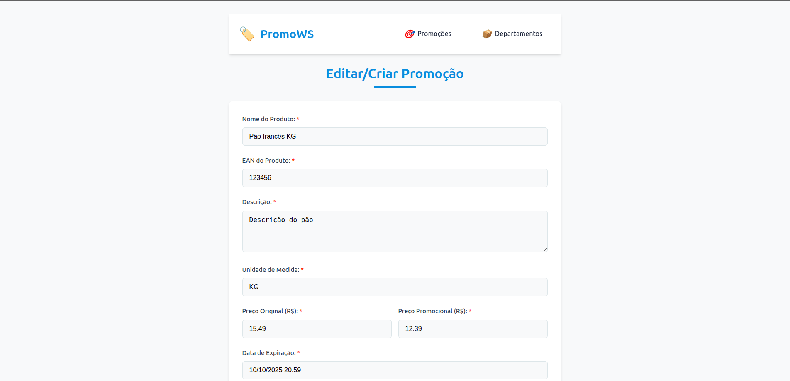
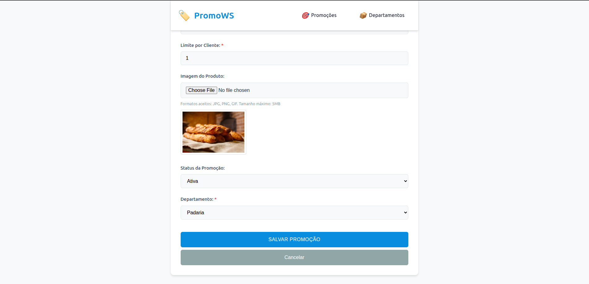

# 🛒 PromoWS - Sistema de Promoções em Tempo Real

Transforme sua TV ou monitor em um **painel de ofertas automático**, atualizado em tempo real direto do seu sistema!

---

## ✨ O que é o PromoWS?

O **PromoWS** é um sistema desenvolvido para facilitar a **divulgação de promoções** dentro de comércios como supermercados, padarias, açougues e hortifrutis.

Com ele, você pode:

✅ Cadastrar promoções com imagem, preço, validade e limite por cliente  
✅ Organizar por departamentos (ex: Açougue, Padaria, Hortifruti)  
✅ Atualizar ofertas em tempo real  
✅ Exibir as promoções em **modo slide** em TVs ou monitores  
✅ Deixar o conteúdo sempre atualizado automaticamente

---

## 🖥️ Telas do Sistema

### 📋 Cadastro de Promoções

Cadastre novas ofertas com todas as informações importantes, inclusive foto:

---

### 📺 Exibição em Slide (TV ou Monitor)

O sistema exibe automaticamente as promoções em **modo apresentação**, com transição de slides e botão de **tela cheia**:

---

## 🚀 Como usar o PromoWS (Nova Abordagem para Desenvolvedores/Usuários Docker)
Para quem já tem o Docker instalado ou está disposto a instalá-lo, o PromoWS é super fácil de colocar no ar. Basta seguir estes passos:

📌 Requisitos
Docker Desktop (ou Docker Engine) instalado no seu sistema. Você pode baixá-lo em: https://www.docker.com/products/docker-desktop/

Git (opcional, para clonar o repositório).

📦 Instalação e Inicialização
Clone o Repositório ou Baixe o Código:

Via Git (Recomendado): Abra seu terminal/CMD e execute:

Bash

git clone https://github.com/seuusuario/seurepositorio.git
cd seurepositorio
(Lembre-se de substituir seuusuario/seurepositorio pelo caminho correto do seu repositório GitHub).

Baixar Zip: Baixe o código-fonte como um arquivo .zip diretamente do GitHub, descompacte-o em uma pasta de sua preferência e navegue até ela via terminal/CMD.

Inicie a Aplicação com Docker Compose:

Dentro da pasta raiz do projeto (onde está o arquivo docker-compose.yml), abra seu terminal/CMD.

Execute o comando:

Bash

docker compose up -d
Este comando irá baixar as imagens necessárias (PostgreSQL e sua imagem da API Spring Boot), criar os containers e iniciá-los em segundo plano. Na primeira vez, isso pode levar alguns minutos.

🌐 Acessando o Sistema
Após o Docker Compose finalizar a inicialização (você pode verificar o status com docker ps), abra seu navegador web.

Digite na barra de endereço: http://localhost:9090 (ou a porta que sua aplicação Spring Boot está configurada para expor).

📺 Exibição em TV ou Monitor
Para exibir as promoções em uma TV ou monitor conectado à mesma rede:

No computador onde o PromoWS está rodando, descubra o endereço IP local. Abra o Prompt de Comando (CMD) e digite ipconfig. Procure por "Endereço IPv4" (ex: 192.168.1.100).

Na TV/monitor (se for um Smart TV com navegador, ou um computador conectado à TV), abra o navegador.

Digite o endereço IP do seu computador seguido da porta: http://[SEU_ENDERECO_IP_AQUI]:9090 (ex: http://192.168.1.100:9090).

No sistema PromoWS, clique no botão de "Tela Cheia" para iniciar o modo de exibição de slides.
---

## 📌 Requisitos

- Um computador com Java instalado (versão 17 ou superior)  
- Navegador Google Chrome ou similar  
- Conexão na mesma rede para a TV ou monitor acessar o sistema  

---

## 📆 Exemplo de Promoção

**Produto**: Pão Francês  
**Departamento**: Padaria  
**Preço de**: R$ 15,49 → **por**: R$ 12,39  
**Validade**: até 10/10/2025 às 20:59  
**Limite por cliente**: 1 unidade  

---

## ❓ Dúvidas?

Entre em contato:  
📧 **uedneymorais@gmail.com**

---

> Desenvolvido com 💙 para valorizar seus produtos no ponto de venda.
