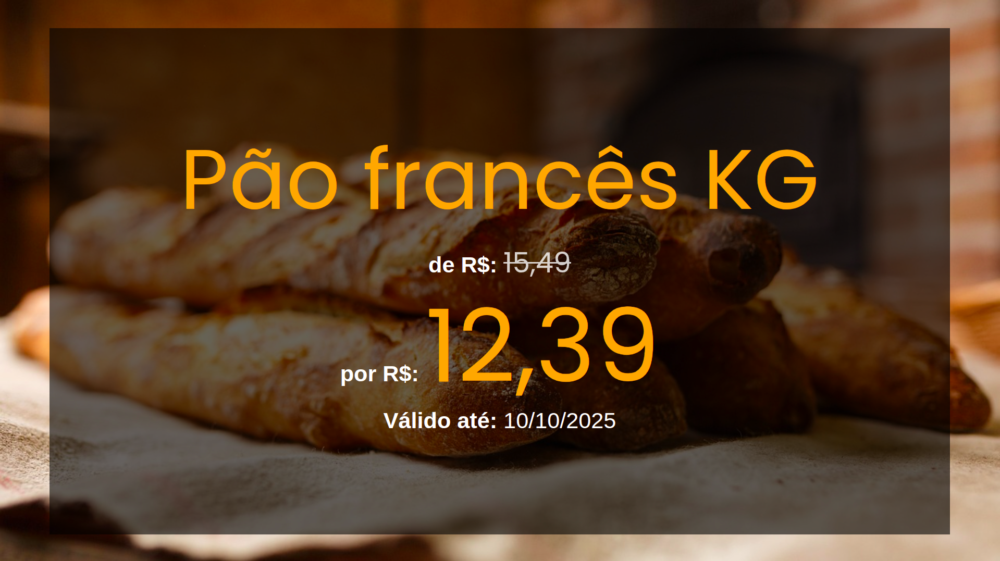

# 🛒 PromoWS - Sistema de Promoções em Tempo Real

Transforme sua TV ou monitor em um **painel de ofertas automático**, atualizado em tempo real direto do seu sistema!

---

## ✨ O que é o PromoWS?

O **PromoWS** é um sistema desenvolvido para facilitar a **divulgação de promoções** dentro de comércios como supermercados, padarias, açougues e hortifrutis.

Com ele, você pode:

✅ Cadastrar promoções com imagem, preço, validade e limite por cliente  
✅ Organizar por departamentos (ex: Açougue, Padaria, Hortifruti)  
✅ Atualizar ofertas em tempo real  
✅ Exibir as promoções em **modo slide** em TVs ou monitores  
✅ Deixar o conteúdo sempre atualizado automaticamente

---

## 🖥️ Telas do Sistema

### 📋 Cadastro de Promoções

Cadastre novas ofertas com todas as informações importantes, inclusive foto:

---

### 📺 Exibição em Slide (TV ou Monitor)

O sistema exibe automaticamente as promoções em **modo apresentação**, com transição de slides e botão de **tela cheia**:

---

## 🚀 Como usar?

1. **Baixe o sistema** clicando no link abaixo
2. **Execute o aplicativo**
3. **Acesse pelo navegador** no seu computador ou rede local
4. Use uma TV ou monitor para exibir as promoções

🔗 [Clique aqui para baixar o sistema](https://github.com/**seuusuario**/**seurepositorio**/releases)

---

## 📌 Requisitos

- Um computador com Java instalado (versão 17 ou superior)  
- Navegador Google Chrome ou similar  
- Conexão na mesma rede para a TV ou monitor acessar o sistema  

---

## 📆 Exemplo de Promoção

**Produto**: Pão Francês  
**Departamento**: Padaria  
**Preço de**: R$ 15,49 → **por**: R$ 12,39  
**Validade**: até 10/10/2025 às 20:59  
**Limite por cliente**: 1 unidade  

---

## ❓ Dúvidas?

Entre em contato:  
📧 **uedneymorais@gmail.com**

---

> Desenvolvido com 💙 para valorizar seus produtos no ponto de venda.
